[TOC]
## 1. Traditional ASR
&emsp;&emsp;根据语音特征帧序列 $O=\{o_1,o_2,...,o_T\}$, 穷举所有可能的*Token*序列$W$，获得后验概率最大的序列$W^*=\{w_1,w_2,...,w_n\}$, 即
$$W^*={\arg\max}_{W\in \mathscr{W}} P(W|O) \tag{1.1} $$
&emsp;&emsp;我们常用word或sub-word来作为token，此时$W$表示子序列或者词序列，$\mathscr{W}$表示所有可能的*Token*序列。
&emsp;&emsp;传统的ASR算法基于bayes法则，将后验概率的求解分解成先验概率和似然概率的形式，从而将ASR系统模块化，根据bayes公式
$$p(W|O)=\frac {P(O|W)P(W)}{P(O)} \tag{1.2}$$
而求解最优$W$与$p(O)$无关，因此有
$$W^*=\mathop{\arg\max}_{W\in \mathscr{W}} P(O|W)P(W)  \tag{1.3}$$
$$p(W)=p(w_1)p(w_2|w_1)p(w_3|w_{1:2})...p(w_n|w_{1:n-1})  \tag{1.4}$$
&emsp;&emsp;似然概率$P(O|W)$的模型称为声学模型，先验概率$P(W)$则由语言模型建模。

## 2. End-to-End ASR

- 端到端ASR算法直接求解后验概率
$$\begin{split} W^*&=\mathop{\arg\max}_{W\in \mathscr{W}} P(W|O) \\
                   &=\mathop{\arg\max}_{W\in \mathscr{W}} p(w_1|O)\cdot p(w_2|w_1,O)\cdot \cdot \cdot \cdot p(w_n|w_{1:n-1}, O) \\
                   &=\mathop{\arg\max}_{W\in \mathscr{W}}\prod_{n=1}^{n} p(w_n|w_{1:n-1},O) \end{split}   \tag{2.1}$$
即：序列整体的后验概率可以通过Token的后验概率累积得到。但这里也做了简化，假设当前Token $w_n$ 只依赖于之前出现的Token $w_{1:n-1}$。
- 目前End2End语音识别算法有三类:
 **Listen-Attend-Spell (LAS) 
 Connectionist Temporal Classification (CTC) 
 Transducer**

### 2.1 LAS
>Chan, W. , et al. "Listen, Attend and Spell." Computer Science (2015).

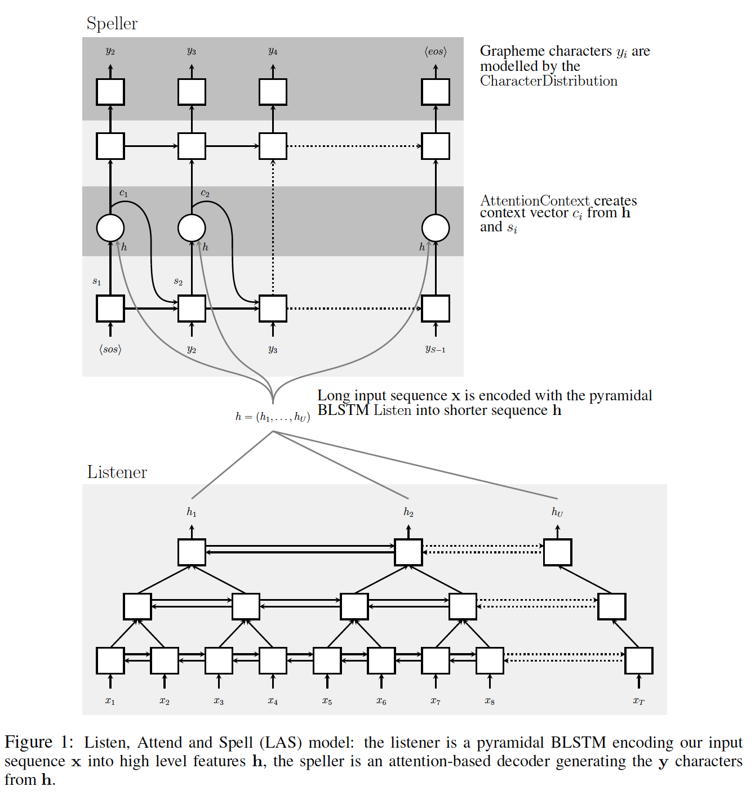

Encoder 用于提取音频的高层次特征
$$H=Encoder(O)  \tag{2.2}$$
Decoder 有两种不同的模式，自回归（AutoRegressive）模式的根据高层特征和历史输出进行解码
$$\begin{split} w_n &=Decoder(w_{1:n-1}, H) \\&=Decoder(w_{1:n-1}, Encoder(O)) \end{split}   \tag{2.3} \\$$
自回归解码过程如下：
$$\begin{split} W^*&=\mathop{\arg\max}_{W\in \mathscr{W}} P(W|O) \\
                   &=\mathop{\arg\max}_{W\in \mathscr{W}} p(w_1|O)\cdot p(w_2|w_1,O)\cdot \cdot \cdot \cdot p(w_N|w_{1:N-1}, O) \\
                   &=\mathop{\arg\max}_{W\in \mathscr{W}}\prod_{n=1}^{N} p(w_n|w_{1:n-1},O) \end{split}   \tag{2.4}$$

非自回归（Non-AutoRegressive）的模型需要对 Encoder 的输出做进一步处理得到初步结果，Decoder 大多只作为一个纠错或重打分模块。

**优点**：真正意义上的端到端算法

**缺点**：效果差，无法流式; 没有利用audio和speech之间的单调性

### 2.2 CTC
>Graves, A. . "Connectionist temporal classification : labelling unsegmented sequence data with recurrent neural networks." Proc. Int. Conf. on Machine Learning, 2006.

&emsp;&emsp;引入blank token实现帧级别**软对齐**，并且假设每一帧之间的token相互独立。
&emsp;&emsp;其中$B(\cdot )$是将软对齐序列转换为最终序列的操作，包含去除相邻重复 Token 和去除 blank，$B^{-1}(W)$是序列 $W$的所有可能的对齐序列，$\pi$是其中一个序列。举例说明$T=8$
$$\begin{split} &B(\pi^{1})=B(ap-pl-ee)=apple\\
                &B(\pi^{2})=B(aa-p-ple)=apple\\
                &B(\pi^{3})=B(ap-ple--)=apple\\
                &B(\pi^{4})=B(aap--ple)=apple\end{split}   $$

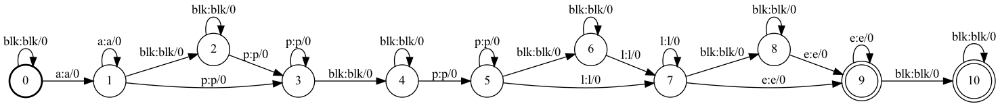

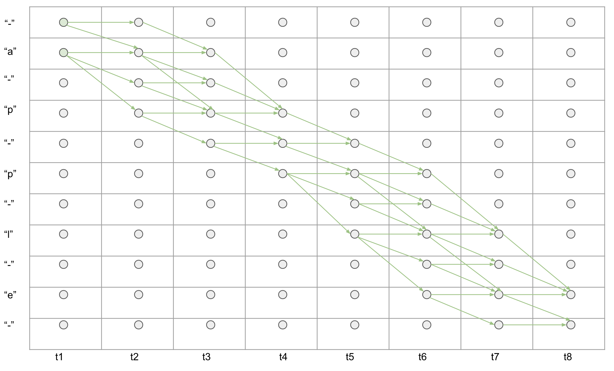

$$\begin{split}  P(W|O) = \sum_{\pi \in B^{-1}(W)}{p(\pi_1|O)p(\pi_2|O)...p(\pi_T|O)} \end{split}  \tag{2.5}$$
> 复杂度高，$|V|^T$
> 能否用viterbi算法可以生成最可能的路径，然后使用交叉熵？不行，viterbi算法在没有探索的情况下，过早地提交路径或初始对齐，结果次优。

训练：
> [ctc loss 推导](https://docs.google.com/presentation/d/12gYcPft9_4cxk2AD6Z6ZlJNa3wvZCW1ms31nhq51vMk/pub?start=false&loop=false&delayms=3000&slide=id.g24e9f0de4f_0_332)
> [ctc.py](ctc.py)
> 
解码：
上述是针对某一个已知序列$W$的后验概率，但是在解码的时候，$W$是待求解的未知量，求解的方法是先求最大概率的对齐序列$\pi^*$，再转换得到$W^*=B(\pi^*)$。
$$\begin{split} \pi^*&=\mathop{\arg\max}_{\pi\in B^{-1}(\mathscr{W})} P(\pi|O) \\ &= \mathop{\arg\max}_{\pi\in B^{-1}(\mathscr{W})} {p(\pi_1|O)p(\pi_2|O)...p(\pi_T|O)} \end{split}   \tag{2.6}$$

**优点**：训练简单，支持流式

**缺点**：收敛慢，输出长度必须小于输入音频的帧长度，输出之间相互独立

### 2.3 Transducer

> Graves, A. . "Sequence Transduction with Recurrent Neural Networks." Computer Science 58.3(2012):235-242.
> [transducer.py](transducer.py)
> Transducer，Encoder为RNN称为RNN-T，Encoder为Transformer称为Transformer-Transducer(T-T)

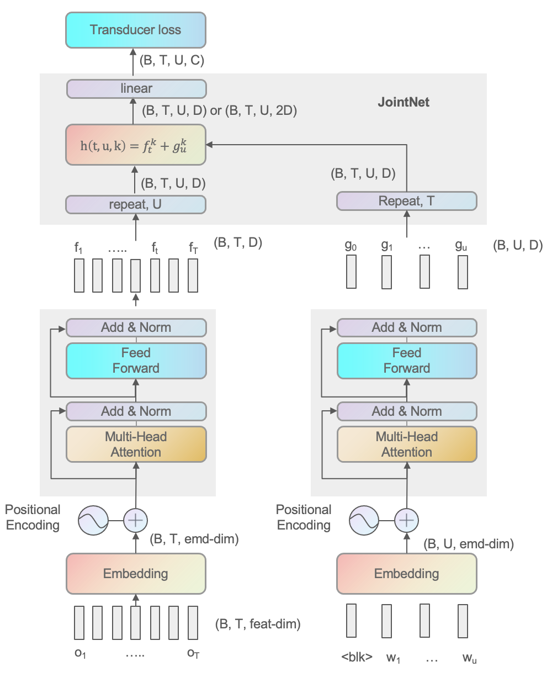

&emsp;&emsp;Transducer 引入了语言模型和一个 JointNet 用于融合声学和语言得分

$$\begin{split}  &f_t = Encoder(o_{1:t}) \\ 
                 &g_u = Predictor(w_{1:u-1}) \\ \end{split}   \tag{2.7}$$
&emsp;&emsp;式中的$t$是解码过程中动态确定的，因为 Transducer 设计的解码算法中，一帧输入是可以对应多个输出的。式中每一个 Token 的后验概率计算过程为：先由 Encoder（声学模型）、PredictorNet（语言模型）独立计算得到声学特征和语言特征：
最后由 JointNet 融合两者得到最终结果
$$p(w_n|w_{1:n-1}, o_{1:t}) = JointNet(f_t, g_n)  \tag{2.8}$$

&emsp;&emsp;其解码过程的计算可以写作下式
$$\begin{split}  \pi^*&=\mathop{\arg\max}_{\pi\in B^{-1}(\mathscr{W})} P(\pi|O) \\
                    &=\mathop{\arg\max}_{\pi\in B^{-1}(\mathscr{W})} p(\pi_1|o_1)\cdot p(\pi_2|\pi_1,o_{1:2})\cdot \cdot \cdot \cdot p(\pi_N|\pi_{1:N-1}, o_{1:T}) \\
                    &=\mathop{\arg\max}_{\pi\in B^{-1}(\mathscr{W})}\prod_{n=1}^{N} p(\pi_n|\pi_{1:n-1},o_{1:t}) \end{split}   \tag{2.9}$$

Transducer 通过 PreditorNet 和 JointNet 引入了 Token 之间的相关性，可以看到，Transducer 的优化目标和 ASR 最初的目标是很接近的，这也是它优于 CTC-based Models 的内在原因。

**优点**：效果较好，支持流式，收敛快

**缺点**：难以训练，需要大量存储资源

#### 2.3.1 transducer forward-backward

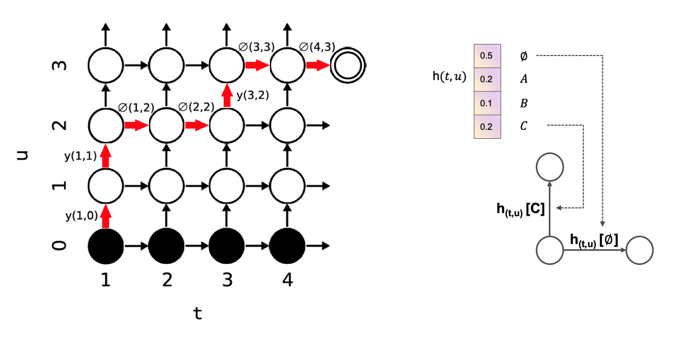

定义：
$$y(t,u)=h(y_{u+1}|t,u) \tag{3.1}$$
$$\varnothing(t,u)=h(\varnothing|t,u) \tag{3.2}$$
- **Forward:** 
当$1\leq t\leq T, 0\leq u \leq U$
$$\begin{split} \alpha(t,u) = \alpha(t-1,u)\varnothing(t-1,u) + \alpha(t,u-1)y(t,u-1) \end{split} \tag{3.3}$$
初始化$\alpha(1,0)=1$,所有输出序列概率和为
$$Pr(y|x)=\alpha(T,U)\varnothing(T,U)$$
- **backward:** 
$$\begin{split} \beta(t,u) =\beta(t+1,u)\varnothing(t,u) + \alpha(t,u+1)y(t,u) \end{split} \tag{3.3}$$
初始化$\beta(T,U)=\varnothing(T,U)$

#### 2.3.2 greedy decode
- 1)开始设置：$t=1, u=0, y=[]$
- 2)用$o$计算$f_t$，用$y$计算$g_u$
- 3)计算$h(t,u)$
- 4)如果$h(t,u)$ 最大值是$\varnothing, t=t+1$ 什么也不输出，继续解码
- &emsp;如果$h(t,u)$ 最大值是一个非$\varnothing$值$A$，$u=u+1, y=[A]$
- 5）t=T+1, 技术解码，否则回到步骤2

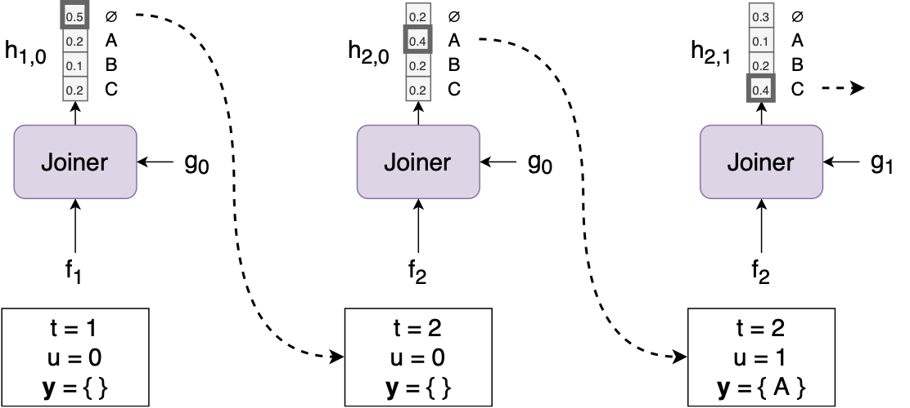

other decoder methed
- Search algorithms:
  - Greedy search constrained to one emission by timestep.
  - Default beam search algorithm [[Graves, 2012]](https://arxiv.org/abs/1211.3711) without prefix search.
  - Alignment-Length Synchronous decoding [[Saon et al., 2020]](https://ieeexplore.ieee.org/abstract/document/9053040).
  - Time Synchronous Decoding [[Saon et al., 2020]](https://ieeexplore.ieee.org/abstract/document/9053040).
  - N-step Constrained beam search modified from [[Kim et al., 2020]](https://arxiv.org/abs/2002.03577).
  - modified Adaptive Expansion Search based on [[Kim et al., 2021]](https://ieeexplore.ieee.org/abstract/document/9250505) and NSC.
#### 2.3.3 对齐
给定(O,W), Transducer定义了一系列可能的单调对齐， 例如，当T=4, 输出序列是（“CAT”）长度U=3

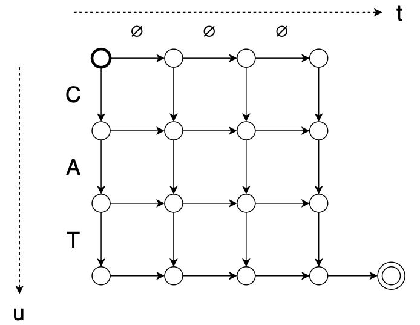

其中一种对齐路径$z = \varnothing,C,A,\varnothing,T,\varnothing,\varnothing$

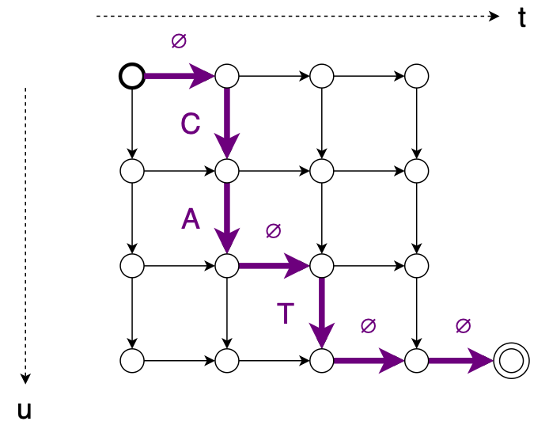

另一种对齐路径$z = C,\varnothing,A,\varnothing,T,\varnothing,\varnothing$

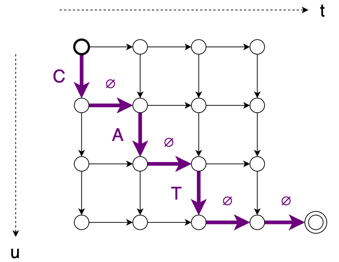

#### 2.3.4 FastEmit

因为RNN-T倾向于延迟输出其预测结果，直到通过获得更多未来帧进而产生更高的confidence之后才输出

> FastEmit: Low-Latency Streaming ASR with Sequence-Level Emission Regularization. [[Yu et al., 2021]](https://arxiv.org/abs/2010.11148).

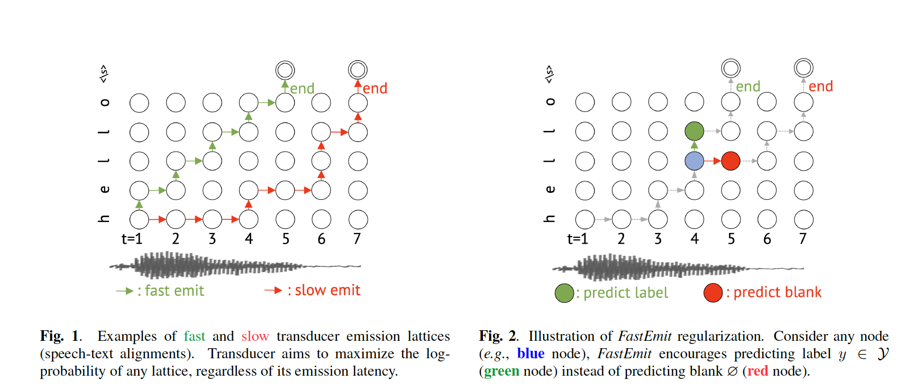

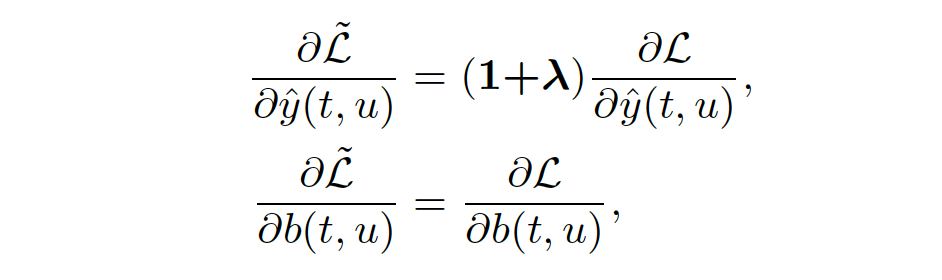

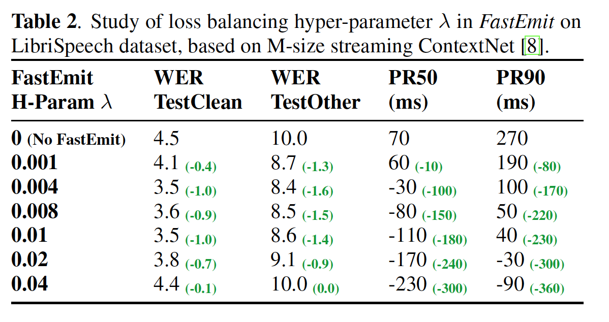

#### 2.3.5 内存使用
&emsp;&emsp;Transducer 是理论上更优的算法，但是普及度较低，主要就是因为训练资源消耗严重，例如$T=1000,U=100,C=1000$个建模单元，$batch=32$ 则$h(t,u)$ 的大小为$B×T×U×C=3,200,000,000$， float存储的话就是12.8GB，
所以训练通常需要大显卡的GPU，或者减小Batch，或者降采样T等措施，k2_ pruned_transducer 也是一种选择

